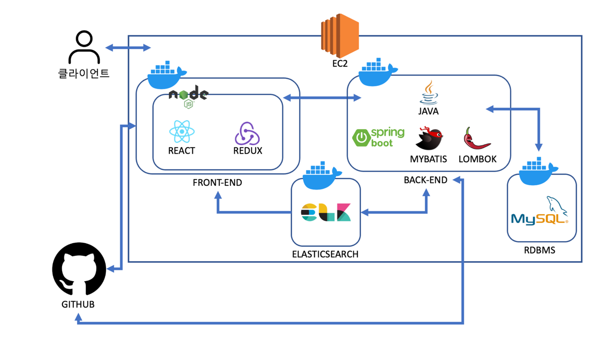

# Aurora(React)

### 루트3은 4조 팀원
* 오승재 - os133517@gmail.com
* 서지수 - seojs3045@gmail.com
* 김수용 - ssssong125@gmail.com 
* 정근호 -  jgh337337@gmail.com
* 허재홍 - zero5140@gmail.com

------------

그룹웨어 

팀 구성 : Frontend/Backend 5인  
진행기간 : 23.03.06 ~ 23.04.18  
주요내용 :
- React로 메인페이지를 구현하였고 네비게이션 사이드바를 사용하여 다른 메뉴로 이동이 가능하도록 구현하였습니다.
- 주요 메뉴로는 메일, 보고, 일정관리, 업무일지, ToDo, 주소록, 근태, 인사, 설문, 예약, 결재, 모니터링, 비품관리, 게시판 등이 있습니다. 

------------

# [개발언어]

### 1. Frontend
#### - Javascript
#### - JQuery (latest)
#### - Ajax
#### - React 
------------  
### 2. Backend
#### - Java 11
------------  
### 3. DB
#### - MySQL 8.0.32 
------------  
### 4. Framework
#### - SpringBoot
#### - Mybatis
------------  
### 5. Tool
#### - Visual Studio Code
#### - Intelli J
------------  
### 6. ETC
#### - Figma
#### - Chrome DevTools
